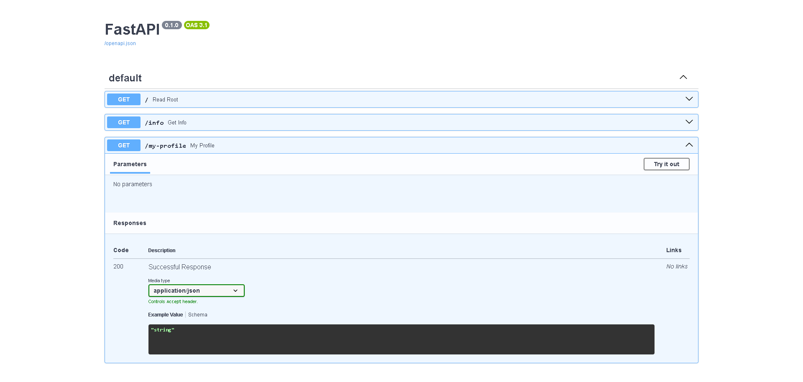

# Mi Primera API FastAPI

## ¿Qué hace?

Una API básica creada en el Bootcamp FastAPI Semana 1.

## ¿Cómo ejecutar?

Para ejecutar esta API localmente, sigue estos pasos:

1.  Instala las dependencias:
    ```bash
    pip install -r requirements.txt
    ```

2.  Ejecuta la aplicación con `uvicorn`:
    ```bash
    uvicorn main:app --reload
    ```

### Endpoints

* `/`: Mensaje de bienvenida
* `/info`: Información de la API
* `/my-profile`: Mi perfil personal

### Documentación

Documentación interactiva:
`http://127.0.0.1:8000/docs`

Captura de pantalla:



### Reflexión

He aprendido a crear un proyecto sencillo de API con FastAPI, definir diferentes endpoints y a generar la documentación de forma automática. Además, he practicado cómo preparar mi proyecto para compartirlo, creando un archivo de requisitos y un README.